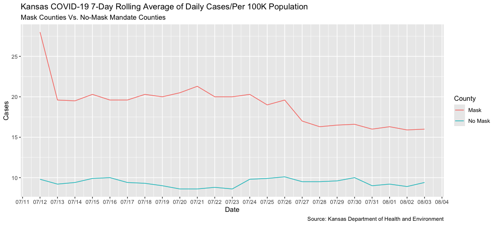

Lab 07 - Conveying the right message through visualisation
================
Fiona Wang
03-02-2025

### Load packages and data

``` r
library(tidyverse) 
```

What is wrong with this graph:  
The scales on the two axes are different. On the left for “mask
mandatory”, the axis ranges from 15 to 25. On the right for “no mask”,
the axis ranges from 4 to 14. One the graph, it seems like there are a
period of overlap between the two lines. It gives the idea that there
are a equal number of daily cases in no mask and mask mandatory
counties. However, that’s far from the truth. If you were to unify the
range, then the blue line (no mask) should be way lower than the orange
line (mask mandatory). In other words, daily cases in no-mask mandatory
counties have fewer 7-day rolling average of daily cases than mask
mandatory counties. That’s how this graph is misleading. The way I will
fix this is to make the two axes have the same range.

### Exercise 1

Create a data frame that can be used to reconstruct the graph.

``` r
df <- tribble(
  ~date, ~cases, ~County,
  "07/12/2020", 28, "Mask",
  "07/12/2020", 9.8, "No Mask",
  "07/13/2020", 19.6, "Mask",
  "07/13/2020", 9.2, "No Mask",
  "07/14/2020", 19.5, "Mask",
  "07/14/2020", 9.4, "No Mask",
  "07/15/2020", 20.3, "Mask",
  "07/15/2020", 9.9, "No Mask",
  "07/16/2020", 19.6, "Mask",
  "07/16/2020", 10, "No Mask",
  "07/17/2020", 19.6, "Mask",
  "07/17/2020", 9.4, "No Mask",
  "07/18/2020", 20.3, "Mask",
  "07/18/2020", 9.3, "No Mask",
  "07/19/2020", 20, "Mask",
  "07/19/2020", 9, "No Mask",
  "07/20/2020", 20.5, "Mask",
  "07/20/2020", 8.6, "No Mask",
  "07/21/2020", 21.3, "Mask",
  "07/21/2020", 8.6, "No Mask",
  "07/22/2020", 20, "Mask",
  "07/22/2020", 8.8, "No Mask",
  "07/23/2020", 20, "Mask",
  "07/23/2020", 8.6, "No Mask",
  "07/24/2020", 20.3, "Mask",
  "07/24/2020", 9.8, "No Mask",
  "07/25/2020", 19, "Mask",
  "07/25/2020", 9.9, "No Mask",
  "07/26/2020", 19.6, "Mask",
  "07/26/2020", 10.1, "No Mask",
  "07/27/2020", 17, "Mask",
  "07/27/2020", 9.5, "No Mask",
  "07/28/2020", 16.3, "Mask",
  "07/28/2020", 9.5, "No Mask",
  "07/29/2020", 16.5, "Mask",
  "07/29/2020", 9.6, "No Mask",
  "07/30/2020", 16.6, "Mask",
  "07/30/2020", 10, "No Mask",
  "07/31/2020", 16, "Mask",
  "07/31/2020", 9, "No Mask",
  "08/01/2020", 16.3, "Mask",
  "08/01/2020", 9.2, "No Mask",
  "08/02/2020", 15.9, "Mask",
  "08/02/2020", 8.9, "No Mask",
  "08/03/2020", 16, "Mask",
  "08/03/2020", 9.4, "No Mask"
)
df
```

    ## # A tibble: 46 × 3
    ##    date       cases County 
    ##    <chr>      <dbl> <chr>  
    ##  1 07/12/2020  28   Mask   
    ##  2 07/12/2020   9.8 No Mask
    ##  3 07/13/2020  19.6 Mask   
    ##  4 07/13/2020   9.2 No Mask
    ##  5 07/14/2020  19.5 Mask   
    ##  6 07/14/2020   9.4 No Mask
    ##  7 07/15/2020  20.3 Mask   
    ##  8 07/15/2020   9.9 No Mask
    ##  9 07/16/2020  19.6 Mask   
    ## 10 07/16/2020  10   No Mask
    ## # ℹ 36 more rows

### Exercise 2

``` r
df<- df %>% 
  mutate(date = as.Date(date, format = "%m/%d/%Y"))
df %>% 
  group_by(date) %>% 
  ggplot(aes(x = date, y = cases, color = County)) +
  geom_line() +
  labs(title = "Kansas COVID-19 7-Day Rolling Average of Daily Cases/Per 100K Population",
       subtitle = "Mask Counties Vs. No-Mask Mandate Counties",
       caption = "Source: Kansas Department of Health and Environment",
       x = "Date", 
       y = "Cases",
       color = "County") +
  scale_x_date(date_labels = "%m/%d", date_breaks = "1 day")
```

<!-- -->

### Exercise 3

In my visualization, the comparison between the counties are more clear.
My graph is not misleading like the original one. They are on the same
scales now. We can see a clear decrease in the number of 7-day rolling
average of daily cases in mask-mandatory counties; however, it is still
a lot higher than the no-mask counties.

### Exercise 4

The information that the graph tells us is surprising. We would think
that mask can protect us from covid, but the graph shows that cases of
Covid is much fewer in no-mask counties. Maybe wearing mask or not
doesn’t matter. But looking more closely, this graph tells us that if
you are living in a place where many people are affected by Covid,
wearing a mask will significantly lower your chance of getting Covid.
However, for a place where Covid is not prevalent, it’s doesn’t matter
as much whether you wear a mask or not. Maybe mask-mandatory counties
ask people to wear mask because they have higher rate of Covid.
